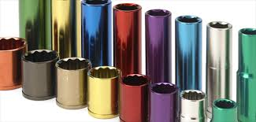

# Anodiseringsanlegg

Oppgaven går ut på å bygge opp / designe et funksjonellt anodiseringsanlegg. Anlegget skal ha mulighet for bevegelse i 3-akser, X, Y og Z. Opbyggningen skal ta utgangspunkt i CNC maskinen [Hector](https://github.com/fellesverkstedet/fabricatable-machines/tree/master/hector-medium-format-cnc) men i en utvidet skala.

Store mengder med materiell inkludert ferdig spor finnes nede på Tip-verkstedet til Torbjørn. Dermed må ikke alle delene freses ut. Hvilke materialer som er tilgjenlig må sjekkes, og det bør skrives en oversikt.

Fusion filer legges under Robotikklinja på Fusion slik at enhver har tilgang til filene.

## Fremdriftsplan 

| Oppgaver som utføres | Utført | Hvem har utført oppgaven | Kommentarer |  
|----------|--------|-------- |-------|
| Moddelere de linære aksene til anlegget |    x    |Filene til Hector er allerede laget. Kokul og Alex har lagt inn tegningene på GitHub | Herman og Kokul startet tegning av x-akse og inkluderende "glider", men i ettertid har vi fått tegninger som vi skal bruke. |
| Moddelere skapet som maskinen skal stå i    |     |  
| Frese deler       |        |   |
| Sette sammen deler(mekanisk)      |        | |
| Idriftsette elektrisk krets       |        | |
| Teste anlegg     |        | |||
